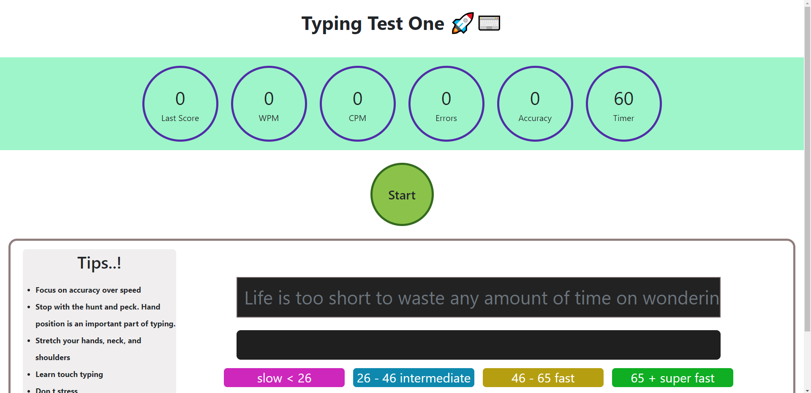

# Typing Test One 🚀⌨️ [(🔗)](https://typingtestone.netlify.app/)

### One minute Typing test challenge

# This project is created for fun and my own practice 😁

## Fetures

- One minute typing challenge
- After the challenge you can all the stats
- it will hold your last score even if you close the tab and come back later
- There are tips to improve your typing
- Speeds are categorize in 4 different segments
- If you try it post a screen shot on social media and tag me 😇 (ly handles are given bellow )

### Screen shot

## If you have any suggestion feel free to reach me out

### `My Contact`

[:red_circle: Instagram](https://www.instagram.com/iamsuraj_dev/)

[:red_circle: LinkedIn](https://www.linkedin.com/in/suraj-biswas-824bb4176/)

[:red_circle: Twitter](https://twitter.com/iamsuraj_dev)

### Available Scripts

In the project directory, you can run:

### `npm start`

### `npm run build`

### `npm run test`

### `npm eject`

## Happy Coding 💻 🙌 😄
